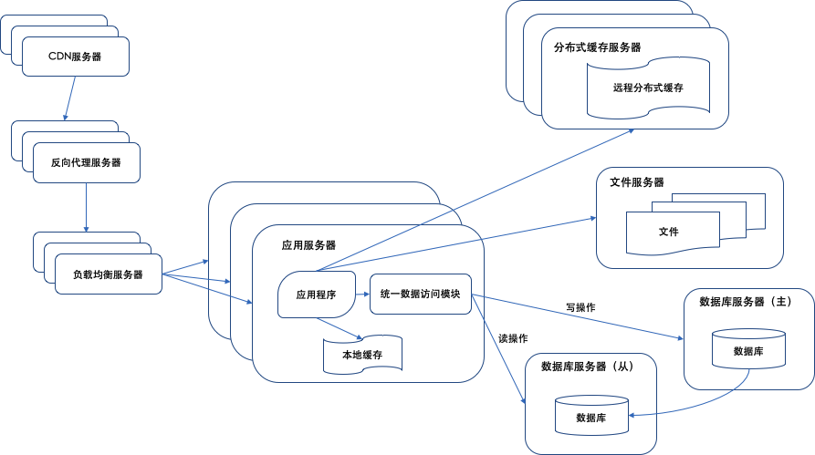
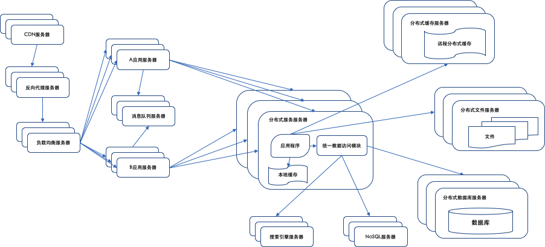
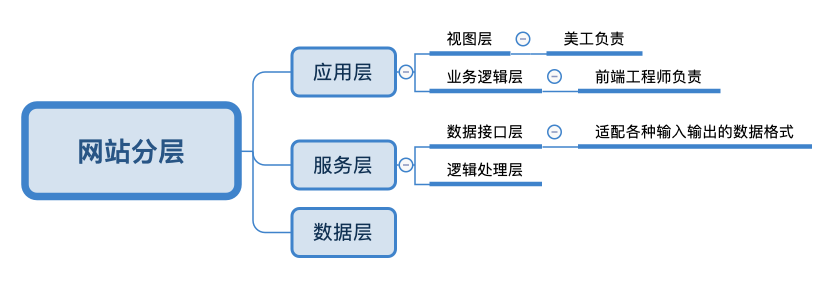
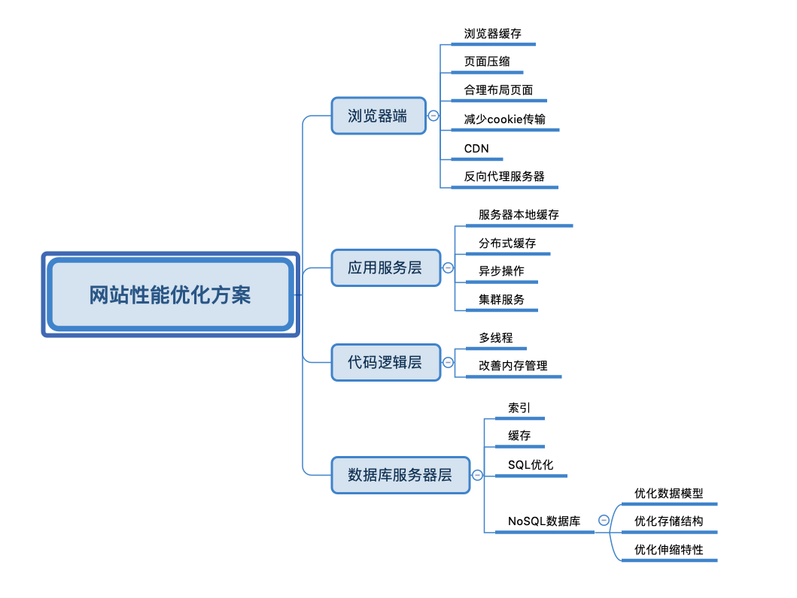
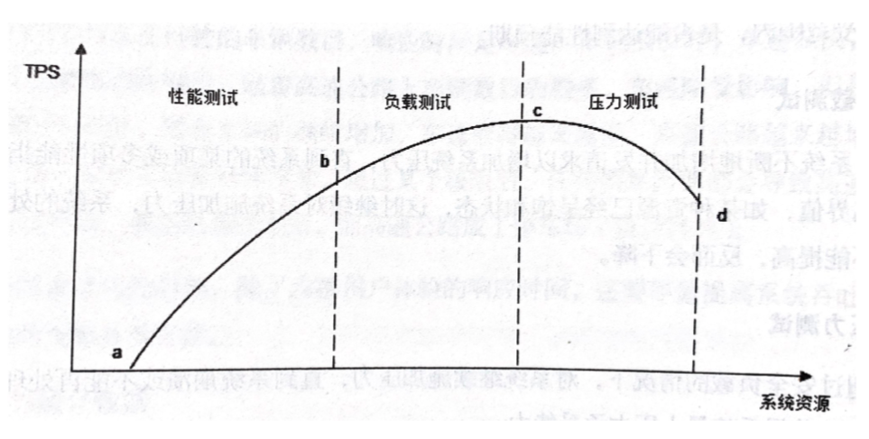
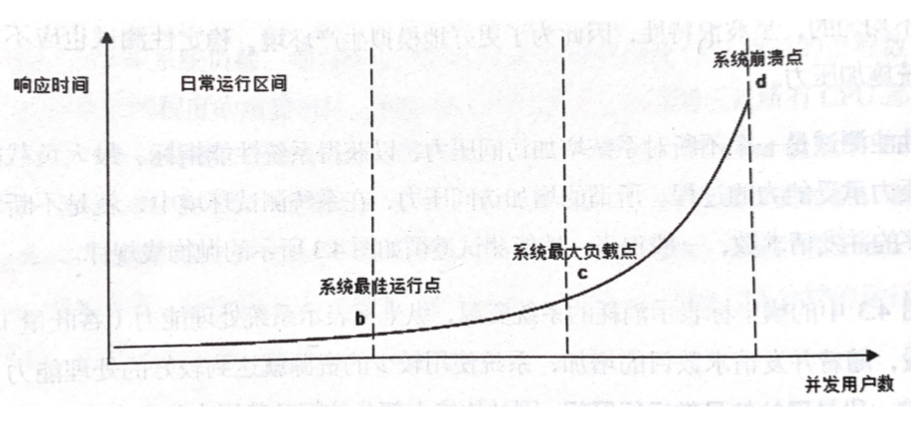

# 【学习笔记】大型网站技术架构
> 作者：willchen
> 邮箱：weiyuchens@sina.com
## 一、大型网站的特点
* 高并发、大流量
* 高可用
* 海量数据
* 用户分布广泛、网络情况复杂
* 安全环境恶劣
* 需求快速变更、发布频繁
* 渐进式发展

## 二、网站架构形态
### 1、常见的网站架构形态

### 2、优化后的网站架构形态

## 三、设计误区
### 1、避免在一开始就过度追求架构方案
* 现将业务发展起来，架构很容易随之而来
* 架构是需要跟着业务发展而发展的

### 2、避免为了技术而技术
* 适用的才是合适的，不是越时髦的技术越适用的

## 四、网站架构模式
### 1、分层
#### （1）分层架构
|  层次  |                    具体职责                     |
| ----- | ---------------------------------------------- |
| 应用层 | 负责具体业务和视图展示，如网站首页和搜索输入输出结果等 |
| 服务层 | 为应用层提供服务支持，如用户管理服务、购车服务等      |
| 数据层 | 提供数据存储访问服务，如数据库、缓存、文件、搜索引擎等 |
#### （2）分层架构的挑战
* 必须合理规划层次边界和接口：严格遵循分层架构的约束，禁止跨层次的调用（应用层直接调用数据层）及逆向调用（数据层调用服务层，或者服务层调用应用层）

#### （3）更详细的分层架构

### 2、分割
#### （1）目的
* 高内聚低耦合

#### （2）优点
* 有助于软件的开发和维护
* 便于不同模块的分布式部署，提高网站的并发处理能力和功能扩展能力

### 3、分布式
#### （1）分布式可能存在的问题
* 依赖于网络，可能会对性能造成严重的影响
* 服务器多了，宕机的概率也更大了，可能会降低网站的可用性
* 分布式环境数据一致性的保证也存在困难

#### （2）分布式方案
* 分布式应用和服务
* 分布式静态资源
* 分布式数据和存储
* 分布式计算
* 分布式配置
* 分布式锁
* 分布式文件系统
* ......

### 4、集群
* 多台服务器部署相同应用构成一个集群，通过负载均衡设备共同对外提供服务

### 5、缓存
缓存是将数据存放在距离计算最近的位置以加快处理速度，缓存也是改善软件性能的第一手段，缓存发难如下：
* CDN（内容分发网络）
* 反向代理
* 本地缓存
* 分布式缓存

### 6、异步
#### （1）目标
* 降低软件耦合性

#### （2）特性
* 单一服务器中通过多线程共享内存对立的方式实现异步，分布式系统中通过分布式消息队列实现队列
* 异步架构是典型的生产者消费者模式
* 提高系统的可用性
* 加快网站的响应速度
* 消除并发访问高峰

### 7、冗余
* 冷备（份）：数据库的定期备份和存档保存
* 热备（份）：数据库主从分离，实时同步

### 8、自动化
发布过程自动化，减少人为干预，流程如下：
```mermaid
graph TD
    subgraph 发布阶段
    自动化代码管理(自动化代码管理)-->|提交测试|自动化测试(自动化测试)
    自动化测试(自动化测试)-->|测试通过|自动化安全检测(自动化安全检测)
    自动化安全检测(自动化安全检测)-->|安全检测通过|自动化部署(自动化部署)
    end
    subgraph 发布阶段
    自动化部署(自动化部署)-->自动化监控(自动化监控)
    自动化监控(自动化监控)-->自动化报警(自动化报警)
    自动化监控(自动化监控)-->自动化失效转移(自动化失效转移)
    自动化失效转移(自动化失效转移)-->自动化失效恢复(自动化失效恢复)
    自动化监控(自动化监控)-->自动化降级(自动化降级)
    自动化监控(自动化监控)-->自动化分配资源(自动化分配资源)
    end
```
### 9、安全
* 注意通信加密
* 注意常用的网站攻击（包括XSS攻击、SQL注入等）需要进行编码转换
* 注意过滤垃圾信息和敏感信息
* 注意对交易转账操作进行风险控制

## 五、大型网站核心架构要素
### 1、性能

### 2、可用性
* 保证高可用的主要手段是冗余，防止宕机影响
* 通过负载均衡来组成集群提供服务
* 存储服务器冷热备份确保数据高可用和一致
* 软件开发的质量保证的一些方式：预发布验证、自动化测试、自动化发布、灰度发布，减少将故障引入线上环境的可能
* 衡量系统是否高可用，就是系统有一台或多台服务器宕机的时候，系统是否依然可用

### 3、伸缩性
* 支持用多台服务器构建集群
* 支持添加新的服务器节点到集群中
* 应用服务器应该尽量无状态（不保存数据），这样就可以将所有服务器节点对等起来，不断添加新的服务器
* 缓存服务器需要考虑新加入的服务器是否会导致缓存路由失效，需要适当改进缓存路由服务器保证缓存数据的可访问性
* 关系数据库的集群伸缩方案必须在数据库之外实现，通过路由分区等手段将部署有多个数据库多服务器组成一个集群
* NoSQL数据库产品多伸缩性支持很好，因为其就是为海量数据而设计的

### 4、扩展性
* 衡量标准就是网站增加或改动新的业务产品的时候，是否会对现有产品或功能产生影响（原则是透明无影响）
* 网站可扩展架构对主要手段是事件驱动架构和分布式服务
* 事件驱动架构（EDA）：
* 分布式服务：业务和可复用服务分离开

### 5、安全性
* 衡量网站安全架构的标准：针对现存的和潜在的各种攻击手段和窃密手段，是否有可靠的应对策略

## 六、网站的高性能架构
### 1、网站性能测试指标  
* 响应时间：应用执行一个操作需要的时间，从发请求开始到收到最后响应数据所需要的时间（**最重要的指标**）
* 吞吐量：指单位时间内系统处理的请求数量（**体现系统的整理处理能力**）
    **注**：*TPS*（每秒事务）、*HPS*（每秒HTTP请求数）、*QPS*（每秒查询数）
* 并发数：指系统能够同时处理请求的数目（**反映系统的负载特性**）
* 性能计数器：它是描述服务器或操作系统性能的一些数据指标。包括System Load（系统负载，反映系统忙闲，*SL = SUM(cpu)*：理想情况；*SL > SUM(cpu)*：进程在排队等待CPU调度，资源不足；*SL < SUM(cpu)*：表示CPU有空闲，资源存在浪费）、对象与线程数、内存使用、CPU使用、磁盘和网络I/O等指标。
    **注**：Linux系统中可以使用top指令进行查看
### 2、网站优化手段
* 适用缓存加速数据读取
* 使用集群提高吞吐能力
* 使用异步消息加快请求响应及实现削峰
* 使用代码手段改善程序性能

### 3、性能测试方法
* 性能测试：有预期目标，进行压测，验证系统性能是否达到预期，确认系统的最佳运行点
* 负载测试：无预期目标，进行压测，到系统的某项或多项指标达到系统的安全临界值，找到系统最大的负载点
* 压力测试：超过安全负载的情况下，继续压测，压到系统崩溃，找到系统的崩溃点（即系统的最大压力承受能力）
* 稳定性测试：在特定的软硬件和网络环境下，进行压测，并运行一段较长的时间，检测系统是否稳定

以下是性能测试曲线：

以下是并发用户访问响应时间曲线：

### 4、性能测试报告简单样式
| 并发数 | 响应时间（ms） | TPS | 错误率（%） | Load | 内存（GB） |  备注   |
| ----- | ------------ | --- | --------- | ---- | --------- | ------- |
| 10    | 500          | 20  | 0          | 5    | 8         | 性能测试 |
| 20    | 800          | 30  | 0          | 10   | 10        | 性能测试 |
| 30    | 1000         | 40  | 2          | 15   | 14        | 性能测试 |
| 40    | 1200         | 45  | 20         | 30   | 16        | 负载测试 |
| 60    | 2000         | 30  | 40         | 50   | 16        | 压力测试 |
| 80    | 超时          | 0   | 100        | 不详  | 不详      | 压力测试 |
### 5、性能优化策略
* 性能分析：
```mermaid
graph TD
    检测各个环节日志-->分析响应时间合理性
    分析响应时间合理性-->检测监控数据
    检测监控数据-->|分析影响性能因素|影响因素
    subgraph 
    影响因素-->内存
    影响因素-->磁盘
    影响因素-->网络
    影响因素-->CPU
    end
```
* 性能优化三大类：Web前端性能优化、应用服务器性能优化、存储服务器性能优化
### 6、Web前端性能优化
* 浏览器访问优化：减少http请求、使用浏览器缓存、启用压缩、CSS在页面最上面，JavaScript在页面最下面、减少cookie传输
* CDN加速
* 反向代理

### 7、应用服务器性能优化
#### （1）分布式缓存
用来存放那些读写比较高、变化比较少的数据

注：合理使用缓存：避免存储频繁修改的数据（容易产生脏数据）、避免没有热点的访问、避免数据不一致导致脏读、缓存可用性的注意、缓存预热的注意（缓存系统启动时就缓存好热点数据）、避免缓存穿透（避免无用数据也落到数据库对数据库造成过大对负担）
#### （2）分布式缓存架构（以Memcached为例）
* 简单的通信协议：TCP通信；通信序列化协议（XML或JSON等文本序列化协议），memcached是基于文本的自定义协议
* 丰富的客户端程序：几乎支持所有主流的网站编程语言，如Java、C++、Python、PHP等
* 高性能等网络通信
* 高校等内存管理
* 互不通信等服务器集群架构

#### （3）使用集群
#### （4）代码优化
* 多线程：需要注意线程安全问题（解决线程安全问题等方案：对象设计为无状态对象、使用局部对象、并发访问资源时使用锁）
* 资源复用：单例、对象池
* 数据结构优化
* 垃圾回收

### 8、存储服务器性能优化
* RAID：廉价磁盘冗余阵列
* HDFS：Hadoop分布式文件系统

## 七、网站的高可用架构
### 1、可用性度量与考核
网站不可用时间计算公式：

$$网站不可用时间=故障修复时间点-故障发现（报告）时间点$$

网站年度可用性指标计算公式：

$$网站年度可用性指标=(1-\frac{网站不可用时间}{年度总时间})\times100\%$$

网站古战分类权重表示例：

|   分类    |                 描述                  | 权重 |
| --------- | ------------------------------------ | --- |
| 事故级故障 | 严重故障，网站整体不可用                | 100 |
| A类故障   | 网站访问不顺畅或核心功能不可用           | 20  |
| B类故障   | 非核心功能不可用，或核心功能少数用户不可用 | 5    |
| C类故障   | 以上故障以外的其他故障                  | 1    |

故障分计算公式：

$$故障分=故障时间(分钟)\times故障权重$$

### 2、高可用的应用
* 通过负载均衡进行无状态服务的失效转移
* 应用服务器集群的Session管理
    * Session复制：多台服务器节点都保存所有用户都session信息，但只能使用在集群规模较小的情况，太大会过度占用通信资源
    * Session绑定：通过负载均衡服务器上的源地址Hash算法绑定Session在某一台服务器上，保证Session总能在这台服务器上获得，但不符合高可用原则
    * 用Cookie记录Session：有一些缺点（比如受Cookie大小限制，能记录的信息有限），但Cookie简单易用、可用性高，受到很多网站但青睐
    * Session服务器：利用独立部署的Session服务器（集群）统一管理Session，将应用服务器的状态分离，分为无状态的应用服务器和有状态的Session服务器，然后针对两种特性分别设计其架构

### 3、高可用的服务
几个高可用服务策略：

* 服务分级管理：核心应用和服务优先
* 超时设置：设置超时时间，一旦超时就抛出异常，然后根据服务调度策略选择继续重试或转移到提供相同服务的其他服务器上
* 异步调用
* 服务降级：高负载时，为了保证核心应用和功能能正常运行，需要对服务进行降级，降级有两种手段——拒绝服务和关闭功能
* 幂等性设计：服务层保证服务重复调用和一次调用产生的结果相同

### 4、高可用的数据
高可用的数据的几个层面的含义：

* 数据持久性
* 数据可访问性
* 数据一致性

CAP原理认为，一个提供数据服务的存储系统无法同时满足数据一致性（Consistency，所有应用程序都能访问达到相同的数据）、数据可用性（Availability，任何时候任何应用程序都可以读写访问）、分区耐受性（Partition Tolerance，系统可以跨网络分区线性伸缩）这三个条件。

数据一致性又分为以下几点：

* 数据强一致：各个副本的数据在物理存储中总是一致的，数据更新结果和操作响应结果总是一致的
* 数据用户一致：在物理存储中各个副本的数据可能不一致，但用户访问时，通过纠错和校验机制，可以确定一个一致且正确但数据返回给用户
* 数据最终一致：一致性中较弱但一种，即物理存储中存储的数据可能是不一致的，用户访问的也可能是不一致的，但通过系统过一段时间但自我恢复和修正，数据最终会达到一致

一般来说，系统会选择数据用户一致。

数据备份，冷备虽然简单廉价，但不能保证数据一致性（定期复制，数据实时性会有延迟）和数据可用性（数据恢复时间比较长，期间服务无法使用）。热备份会提供更好的数据可用性，热备一般有两种，异步热备和同步热备。
异步热备：

```mermaid
graph LR
    subgraph 应用程序
    存储服务器客户端
    end
    subgraph 存储服务器
    存储服务器客户端-->|数据读写|存储服务器写操作代理
    存储服务器写操作代理-->存储服务
    end
    subgraph 存储服务器_从
    存储服务器写操作代理-->|异步写操作|存储服务_从
    end
```

同步热备：

```mermaid
graph LR
    subgraph 应用程序
    存储服务器客户端
    end
    subgraph 存储服务器1
    存储服务器客户端-->|数据读写|存储服务1
    end
    subgraph 存储服务器2
    存储服务器客户端-->|数据读写|存储服务2
    end
```

如果服务器集群中出现服务器宕机，那系统就应该针对这台机器的所有读写操作都进行失效转移，失效转移有三步：

* 失效确认
* 访问转移
* 数据恢复

### 5、网站运行监控
* 监控数据采集
    * 用户行为日志收集
        * 服务端日志收集
        * 客户端浏览器日志收集
    * 服务器性能监控
    * 运行数据报告
* 监控管理
    * 系统报警
    * 失效转移
    * 自动优雅降级
## 八、网站的伸缩性架构
### 1、网站架构的伸缩性设计
#### （1）根据不同的功能进行物理分离实现伸缩
物理分离：

```mermaid
graph TD
    单一服务器处理所有服务(单一服务器处理所有服务)-->数据库从应用服务器分离(数据库从应用服务器分离)
    数据库从应用服务器分离(数据库从应用服务器分离)-->缓存从应用服务器分离(缓存从应用服务器分离)
    缓存从应用服务器分离(缓存从应用服务器分离)-->静态资源从应用服务器分离(静态资源从应用服务器分离)
```

纵向分离：
```mermaid
graph TD
    网站具体产品(网站具体产品)-->可复用业务服务(可复用业务服务)
    可复用业务服务(可复用业务服务)-->基础技术服务(基础技术服务)
    基础技术服务(基础技术服务)-->数据库(数据库)
```

横向分离：

```mermaid
graph LR
    网站前台(网站前台)-->卖家后台(卖家后台)
    卖家后台(卖家后台)-->买家后台(买家后台)
    买家后台(买家后台)-->交易论坛(交易论坛)
```

#### （2）单一功能通过集群规模实现伸缩

### 2、负载均衡的技术
#### （1）HTTP重定向负载均衡
#### （2）DNS域名解析负载均衡
#### （3）反向代理负载均衡
#### （4）IP负载均衡
#### （5）数据链路负载均衡
#### （6）负载均衡算法